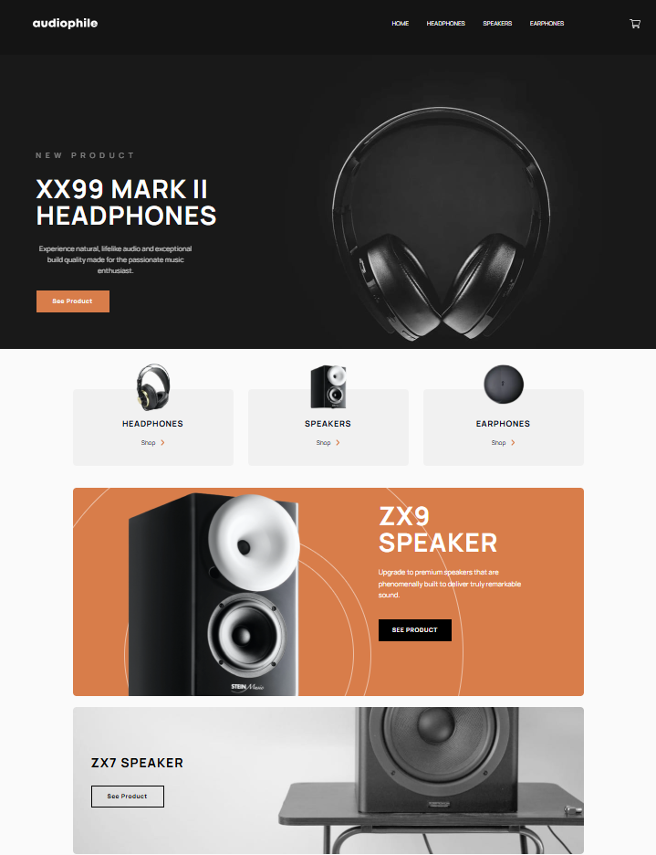

# 🎧 Audiophile E-commerce Website

A modern and fully responsive e-commerce website built with Next.js,
React, TypeScript, and Tailwind CSS. This project was developed as
part of a Frontend Mentor challenge and simulates a real-world online
shopping experience for high-quality audio products.

## 📸 Screenshot



## 🚀 Features

- Browse a collection of audio products (headphones, speakers,
  accessories)
- View detailed product pages with specifications
- Add products to the shopping cart
- Update product quantities or remove items from cart
- Fully responsive design across all devices
- Dynamic cart management and UI updates
- Multi-page navigation with smooth transitions
- Clean and modern shopping experience

## 🛠️ Technologies Used

- Next.js
- React.js
- TypeScript
- Tailwind CSS

## 📖 About The Project

This project is an Audiophile e-commerce website developed as part of
a Frontend Mentor challenge. The goal was to build a realistic and
interactive online shopping experience for audio products, including
headphones, speakers, and accessories.

Users can explore different products, view detailed product pages, and
manage items in a shopping cart. The cart allows adding products,
updating quantities, and removing items, with all changes reflected
dynamically in the user interface.

The main focus of this project was transforming a professional UI
design into a fully functional web application, with attention to data
handling, responsive layouts, and smooth user interactions across all
devices.

This project demonstrates my ability to:

- Build multi-page e-commerce applications
- Work with TypeScript in a real-world project
- Manage complex application state (shopping cart)
- Handle structured product data
- Create responsive and modern UI designs
- Implement dynamic and interactive frontend features

## 🛒 User Flow

1. Browse product categories (Headphones, Speakers, Accessories)
2. View product details
3. Add products to cart
4. Update quantity or remove items
5. Proceed through cart interaction

## ▶️ Installation & Setup

1. Clone the repository:

```bash id="z8m2pq"
git clone https://github.com/mehdias63/Audiophile-e-commerce-website.git
```

2. Navigate to the project directory:

```bash id="k9x1sd"
cd audiophile-ecommerce
```

3. Install dependencies:

```bash id="q2v8nc"
npm install
```

4. Run the development server:

```bash id="r6t3wm"
npm run dev
```

5. Open your browser and visit:

```text id="p5y7lk"
http://localhost:3000
```

## 🌐 Live Demo

[View Demo](https://audiophile-e-commerce-website-nine.vercel.app/)

## 👨‍💻 Author

Developed by Mehdi Tatasadi
